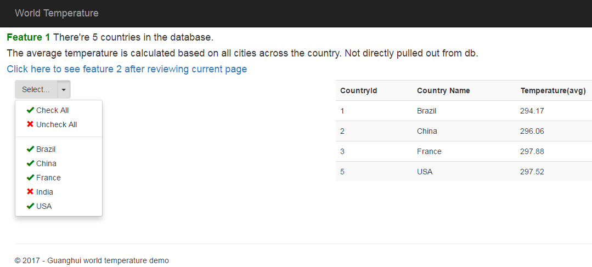
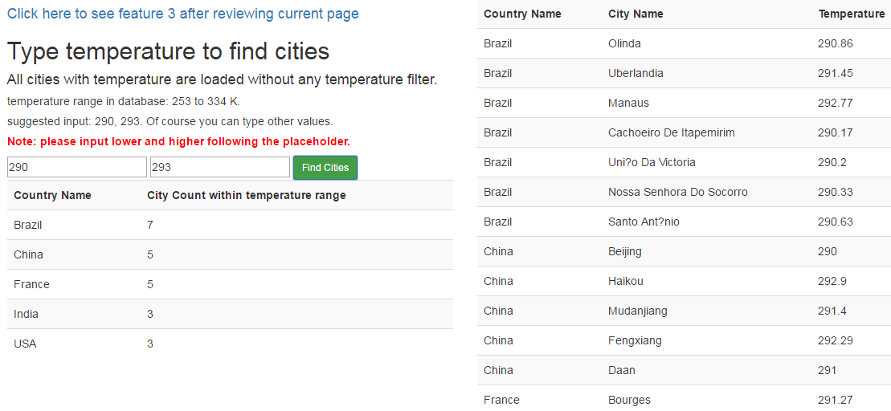
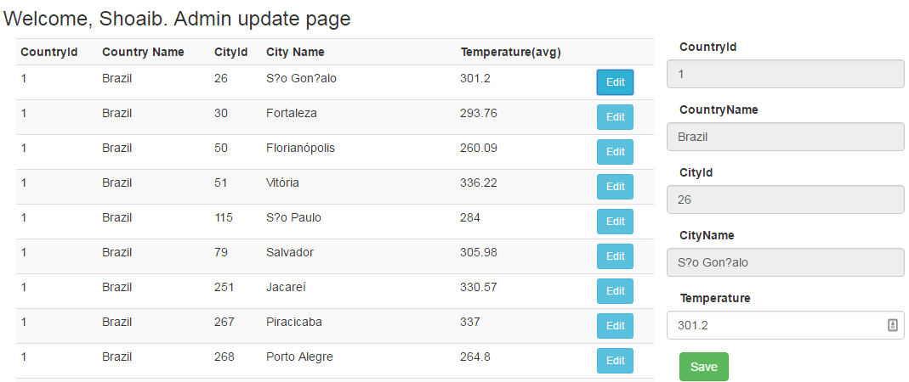

# World Temperature App

This demo project shows some countries, their cities and temperature. The temperature is created by inserting some random numbers between 253 to 334 K.

### List of coutries and average temperature:


### Find cities based on temperature range:


### Admin update page:



## Skills and environment

MVC| Webapi | ADO.net | MSSQL| basic three-tier architecture | Angularjs 1 | Bootstrap | Newtonsoft

Angularjs skills includes controller, directive, filter and service.

No dependency injection. No server or client-side model validation

## Naming convention:

- MvcController => CityController
- ApiController => CitiesController

## Installation and startup:

1. In App_Data folder add database WorldWeather.mdf
1. In Server Explorer, right click _New Query_ and run the script **GuanghuiWeather.sql**
1. Modify connection string in web.config, no Initial Catalog but replace Directory.
    ```xml
    <add name="connstr" connectionString="Data Source=(LocalDB)\MSSQLLocalDB;AttachDbFilename=|Directory|\Guanghui.Weather.Webapp\App_Data\WorldWeather.mdf;Integrated Security=True" />
    ```
1. Set Guanghui.Weather.Webapp as startup project
1. Restore nuget packages
1. Run the project and review localhost/Country/Index
